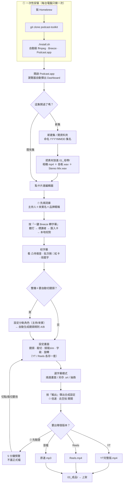

# podcast-toolkit

把 podcast 的**原始錄影 + 錄音**，一路做成可以上架的**成品影片（YT 完整版 / Reels 直式）和音檔（MP3）**的工具。

> 你不用會寫程式。裝好之後，幾乎所有事情都在**瀏覽器裡點一點**就完成（轉字幕、校字幕、選鏡頭、裁切、輸出）。下面從零教到輸出。

---

## 這個工具幫你做什麼？

一集 podcast 從錄完到上架，要經過這些事，這個工具把它們串起來、大部分自動化：

```
錄好的素材（2 台相機 + 幾軌麥克風 + 一軌混音）
   │
   ▼  ① 轉字幕   ── 一鍵 Breeze（本地 AI 聽打，免上網、免金鑰），自動標誰在講話
   ▼  ② 校字幕   ── 自動校對 + 你在編輯器裡改錯字
   ▼  ③ 設定    ── 裁切畫面、切頭尾、字幕大小、要不要加速、要不要去掉空拍停頓
   ▼  ④ 鏡頭    ── 一鍵「依講者推 A/B」：來賓講話自動切特寫、主持回全景
   ▼  ⑤ 輸出    ── YT 完整版.mp4 / Reels 短版.mp4 / 原速 MP3（純音訊）
```

全部在瀏覽器介面操作，**不用打指令**（進階者也保留了 CLI）。

### 完整操作流程圖（從裝好到出片）

> 上面那張是「內容主線」；下面這張把**從安裝到輸出成品的每一步、分支與決策點**都畫出來（在 GitHub 網頁上會自動渲染成流程圖）。菱形＝要你做選擇的地方，⏱＝容易忘、但錯過會後悔的關卡。



---

## 重點功能與能達到的效果

> 一句話：把「錄完的雙機素材」變成「可上架的 YT／Reels／MP3」，中間該做的事大多自動化，且**全程本地不上雲、免 API 金鑰**。

**轉字幕與校對**
- **一鍵 Breeze 轉字幕（本地、自動標講者）** — 按一顆就把分軌錄音整條龍跑完：各軌 mic 聽打 → 自動標誰在講（a/b/c）→ 匯入字幕卡 → 本地校對。免金鑰、聲音不上雲。
- **AI 逐句字幕校對（本地零金鑰）** — 轉完自動用本地 Claude Code 依保守規則修同音近音錯字、台灣慣用字與代名詞，只改文字不動時間；沒裝也照跑不報錯。
- **瀏覽器字幕卡逐句校對** — 字幕攤成一張張卡直接改字，Enter 切句、Backspace 合併，可插卡／刪卡，存檔自動重編號，卡號（#idx）方便對照溝通。
- **專有名詞詞庫（本集／跨集／全域三層合併）** — 先把人名品牌暱稱教給引擎，轉字幕當提詞、校對自動修正，減少一直校同一個錯字。

**鏡頭與音檔對齊**
- **依講者自動推鏡頭 A/B** — 雙機訪談自動生出整集鏡頭切換（來賓講滿門檻切特寫、講完回全景，切點落在交接靜默處），實測逐卡吻合約 99%，人只需微調例外。
- **雙機自動對齊 + 外接混音取代原音** — 抽兩機音訊互相關、2 秒內算出偏移對齊雙機畫面；最終聲音改用 Stereo Mix 混音軌，畫面／字幕／刪段全部自動跟著對齊。

**出片設定**
- **裁切／頭尾 trim／旋轉拉正** — 影片下方一個面板搞定重新構圖、切掉開場閒聊與收尾空白、把錄歪的畫面轉正；YT 與 Reels 各存一套設定。
- **倍速 + 全片去空拍** — 只加速正片（片頭尾不動、字幕自動同步），並自動跳剪中段長停頓，成品更緊湊、資訊密度更高。

**輸出**
- **多版本一鍵輸出** — 同一集產出 16:9 含片頭尾的 YT 完整版.mp4、9:16 短版 Reels.mp4、純音訊原速 MP3，各自套好裁切與字幕樣式。
- **字幕輸出三模式** — 字幕可「燒進畫面」、或 YT「另存 sidecar .srt」（不燒更快、可在 YouTube 開關 CC）、或「抽換 overlay」（拿外部修好的字幕重燒、不用重剪）。
- **5 分鐘畫質預覽** — 輸出 55 分鐘完整版前先合成前 5 分鐘（檔名加 `.preview` 不蓋正式檔），確認頭尾切點／裁切／鏡頭／畫質再跑整支。

**總覽**
- **集數 Dashboard** — 一開就看到每集卡在哪個階段（未轉字幕／未合成／完成／損毀），點卡片直接進編輯器，不用自己記路徑。

---

## 名詞先看懂（新手必讀）

| 名詞 | 白話解釋 |
|---|---|
| **集（episode）** | 一集節目。每集是一個資料夾，命名習慣 `YYYYMMDD 集名`，例如 `20260629 留白計畫 王奕翔`。 |
| **母帶 / 素材** | 你錄的原始檔（相機 mp4、麥克風 wav）。放在集資料夾的 `01_母帶/`。 |
| **混音（Stereo Mix）** | 把所有麥克風混在一起的那一軌（`Stereo Mix.wav`）。最終影片/MP3 的聲音用這軌（音質最好），不是用相機內建的爛聲音。 |
| **分軌 / mic 軌** | 每個人各自一軌麥克風（Track1/2/3）。用來「分別聽打 → 知道每句話是誰講的」。 |
| **字幕軌 / 字幕卡** | 聽打出來的字幕，一句一張「卡」。編輯器裡就是一張張可以改字、改時間的卡片。 |
| **講者（speaker）** | 這句話是誰講的（a/b/c…）。分軌轉字幕會自動標。 |
| **鏡頭 A / B** | 雙機拍攝：cam A 通常是「全景」（看得到全部人），cam B 通常是「來賓特寫」。 |
| **裁切（crop）** | 把畫面框小一點、重新構圖（例如去掉天花板、桌上雜物）。 |
| **頭尾 trim** | 切掉開頭的試音閒聊、結尾的收場空白。 |
| **去空拍 / 跳剪** | 自動偵測中間「沒人講話的停頓」，輸出時跳過，讓節奏更緊。 |
| **倍速** | 只加速「正片」（片頭片尾不動），例如 1.15 倍，影片更精簡。 |
| **合成 / 輸出（assemble）** | 把上面所有設定燒進影片，產生最終 mp4 / mp3。 |

---

## 安裝（第一次拿到電腦才要做，只做一次）

**限 macOS（Apple Silicon）。** 先裝 Homebrew（一次性），再跑一支腳本，全部裝好（含 Breeze 轉字幕）。

**前置（一次性）：**
```bash
# Homebrew（已裝跳過）
/bin/bash -c "$(curl -fsSL https://raw.githubusercontent.com/Homebrew/install/HEAD/install.sh)"
```
> Breeze 已改為公開 repo，`install.sh` 直接用 `git clone` 下載，不需要 GitHub CLI、也不需要登入或存取權。

**一鍵安裝：**
```bash
cd ~/Projects
git clone https://github.com/Liiiiwei/podcast-toolkit.git
cd podcast-toolkit
./install.sh
```

`install.sh` 一支跑完會自動：檢查 Python 3.9+、裝 ffmpeg、裝 toolkit 套件、建立 `podcast` 指令、在 `/Applications/` 生成可雙擊的 `Podcast.app`（本機生成、不被 Gatekeeper 攔），**並且把 Breeze 轉字幕後端也一起裝好**（`git clone` 公開 repo → 建專用 venv → 裝打過補丁的 whisper + jieba 詞典）。

> Breeze 首次「一鍵轉字幕」時才會自動下載 2.9G 模型到 `~/.cache/whisper`（之後不再下載）。
> Breeze 那段若因網路等因素失敗，install 不會中斷；排除後重跑 `./install.sh` 即可補上。

**轉字幕引擎（本地、免金鑰）：**

- **Breeze（預設，install.sh 已幫你裝）**：台灣腔最準、會標講者。裝在 `~/Developer/breeze subtitle/Breeze-ASR-25`。
- **本機 Whisper（mlx，備援）**：Breeze 沒裝成時的退路，Apple Silicon 跑、免金鑰、但不標講者。`pip3 install --user mlx-whisper`。

> 這個工具**零雲端金鑰**：不需要 OpenAI / Gemini 等 API key，聲音不會上傳到雲端。

---

## 怎麼打開來用（每次要用都這樣）

**最快：**
1. 按住鍵盤 `⌘`（command）不放，再按一下空白鍵 → 跳出搜尋框。
2. 打「Podcast」→ 按 Enter。
3. 等 2～5 秒，瀏覽器會自己打開介面。

**用滑鼠：** Finder（藍白笑臉）→ 應用程式 → 連點兩下 **Podcast**。

**狀況排除：**
- 瀏覽器沒跳出來？再打開一次 Podcast 就好，它會自己接上。
- 想更快開？第一次開後，Dock 上會出現 Podcast 圖示，右鍵 →「在 Dock 中保留」。
- 用完關掉瀏覽器分頁即可。

> 進階者：終端機打 `podcast ui` 開同一個介面。搬動專案資料夾後重跑 `./install.sh` 即可修好。

---

## 做一集：從頭到尾（照順序做）

打開介面後，先看到的是 **Dashboard（集數列表）**。

### 第 0 步：把集資料夾準備好

1. 在 `~/Downloads/` 建一個資料夾，命名 `YYYYMMDD 集名`（例如 `20260629 留白計畫 王奕翔`）。
2. Dashboard 右上「**新建集**」會幫你建好子資料夾結構，或用 Dashboard 的「**開資料夾**」選現有資料夾。
3. 子資料夾結構（init 自動建）：
   - `01_母帶/` — 放原始檔：兩台相機 mp4、各軌麥克風 wav、`Stereo Mix.wav`。
   - `03_成品/` — 字幕、最終影片會放這。
   - `04_工作檔/` — 中間暫存。

> **音檔放哪？** 相機 mp4 + 麥克風 wav + Stereo Mix 都放 `01_母帶/`。

### 第 1 步：轉字幕（一鍵 Breeze）

> **⏱ 按下去之前，先填一次詞庫（重要）。** 把本集**主持人＋來賓名、品牌暱稱**先填進詞庫（怎麼填見下方〈進階參考 · 詞庫〉，或編輯器「字典」分頁）。這些字會在你按「一鍵 Breeze」的當下當作**提詞**餵給引擎，直接影響它把專名聽對的機率——**沒先填，來賓藝名幾乎一定被轉錯**。錯了事後可 find-replace 修、不必重轉，但開集就花 1 分鐘填最省事。

1. Dashboard **點這集** → 進編輯器。新集會顯示「需轉字幕」。
2. 點「轉字幕」→ 按 **「一鍵 Breeze 轉字幕（推薦）」**。
3. 它會**背景一次跑完整條龍**，你只要等：
   ```
   Breeze 聽打各軌 mic（最久，依片長約 20–60 分）
     → 自動標講者（Mic1/2/3 → a/b/c）
     → 匯入成字幕卡 + 講者表
     → 本地校對（自動修同音字/術語）
   ```
4. **不用一軌一軌按**，一鍵全包。跑完字幕卡 + 講者著色就出現了。

> 沒有 Breeze 專案的話，也可以用本機 Whisper（mlx）轉，但不會標講者。

### 第 2 步：校字幕（改錯字）

- 自動校對已經修掉大部分。剩下的**專有名詞**（人名、品牌、地名）AI 容易聽錯，你在編輯器裡：
  - 直接點字幕卡的文字改字。
  - 改完按「完成並儲存」。
- 字幕卡工具列上的「**偏移**」鈕（時鐘圖示）點開後可輸入秒數整份平移，**不改原檔**（預覽和輸出都會套用）。輸入的是「目前偏移總量」的絕對值：正值＝往後延、負值＝往前提、0 或留空＝清除。對不準時用。
- 想確認某張卡對不對：把播放頭停在那張卡上按鍵盤 **P**，會從卡頭播到卡尾自動停，快速聽這句（停在卡與卡之間的空窗按 P 不動作）。

#### 編輯器會自動幫你「圈出要再看一眼的卡」

開集時編輯器會掃過每張卡，幫你標出兩種「可能要處理」的卡（**即時計算、不會改到字幕原檔**）：

- **⚠ 待複查（黃色 ⚠ 在時間旁）** — 這句**內容**可能怪怪的，請看一眼別急著刪：
  - **話像沒講完**：句子斷在連接詞上（…因為／所以／但是／然後／就…）或結尾停在「很、會、在、就、把、被、跟、和」這種字。通常是斷句斷壞了，可以跟下一句合併。
  - **AI 跳針**：聽打出現重複幻覺（例如「對對對對對」整句重複），要改掉。
  - 上方工具列可「**只看待複查**」篩選，或用 **跳上一張** ／ **跳下一張**（或鍵盤 J／K）一張接一張審；看完一張按卡上的 **看過**，它會淡掉、從待複查計數扣掉、J／K 也跳過它（只存這次編輯、不寫原檔，換集就清空）。
- **🔴 可疑空拍卡（紅卡）** — 這句**多半是廢卡、可以整批刪**：
  - **只有語助詞**：整句就一個「對／嗯／哈哈／哇／喔…」之類。
  - **字超少卻很長**：字數少於 3 個，時長卻超過 2 秒（八成是空拍硬塞了一句）。
  - **前面一大段沒聲音**：跟前一張卡中間空了超過 1.5 秒。
  - 紅卡有專屬工具列：**全選紅卡 / 刪除已勾 / 刪純反應詞**，清掉空拍卡很快。勾選時會顯示「**已勾 N·約 X.X 秒**」（約略值，每側多留 `cut_pad` 0.15 秒）；量偏大（≥10 張或約 >30 秒）按 **刪除已勾** 會先跳二次確認，刪了仍可復原。

> 兩種標記**刻意分開**：黃色 ⚠ 是「請你看一眼」、不會被批次刪；紅卡才是「可整批刪」。判定門檻可在 `episode.yaml` 的 `suspicious_pause` / `resegment` 區塊逐集調（見下方進階參考），沒設就吃 `defaults.yaml` 預設。

### 第 3 步：分軌角色 →（為了自動鏡頭）

如果是雙機 + 分軌、想要自動切鏡頭：

1. 轉字幕區「進階：分軌轉錄」→「設定並啟用分軌轉錄」。
2. 每軌指定對應的音檔 + 標 **主持 / 來賓**，並設「來賓講滿幾秒切特寫」（預設 15 秒）。
3. 存檔 → 自動生成鏡頭規則（`camera_rule`）：**主持→全景 cam A、來賓→特寫 cam B**。來賓軌號每集不同也沒關係，由你標的角色決定。

### 第 4 步：設定畫面（鏡頭/裁切/頭尾/字級/旋轉/倍速/去空拍）

分兩處：頂部「**鏡頭**」按鈕（點開「鏡頭與音檔對齊」視窗）＋ 影片下方的「**出片設定**」摺疊面板（預設收合，寫著「裁切比例 · 頭尾 · 旋轉 · 字級 · 封面」，點一下展開）。

**在「鏡頭」視窗裡：**
- **外接 mix 音檔**：選 `Stereo Mix.wav`（最終聲音用混音，不是相機聲）。
- **依講者推 A/B**：依講者 + 規則自動生成 A/B 切換點（來賓講滿門檻→特寫，講完回全景）。切點放在交接的靜默中點，比較自然。事後仍可在字幕卡上手動微調個別段落。

**在「出片設定」面板裡（上方版本分頁切 YT / Reels，兩套各存各的）：**
- **裁切框 crop**：雙擊影片區拉裁切框重新構圖。
- **字幕字級**：`字幕 − [值] ＋`，依目前 YT / Reels 分頁各調各的，即時預覽（預覽字級對齊實際燒字幕輸出）。
- **頭尾 trim**：設頭／設尾／從頭播／重設，或拖 seek bar 兩端把手（鍵盤 ←→ 微調），切掉開頭試音、結尾收場；也有「智慧建議」自動抓頭尾靜音。
- **旋轉拉正**：把錄歪的畫面轉正（度數）。
- **節目封面 / 浮水印**：開關。

> **倍速 / 去空拍**不在這個面板，而是按下輸出時跳出的「**合成設定**」視窗裡開關（倍速例如 1.15、去空拍偵測 ≥0.8 秒的停頓跳剪）。

### 第 5 步：輸出

頂部右側「**輸出 ▾**」下拉（在「鏡頭」按鈕右邊）。展開後上半先選**字幕模式**、下半是四個輸出動作：

**字幕模式（先選）：**
- **燒進畫面**（預設）：字幕直接壓在影片上。
- **另存字幕檔（僅 YT）**：影片不燒字幕，另外輸出一份已對齊成品時間軸的 `.srt`（跳過燒字幕→更快，觀眾可在 YouTube 開關 CC）。
- **抽換字幕**：拿外部（例如從 YouTube 下載修好）的 `.srt` 直接燒回成品，鏡頭／刪段／倍速照舊、另存新檔不蓋原成品，不必重跑整條管線。

**輸出動作：**
- **合成 YT** → `03_成品/{集名}_YT完整版.mp4`（16:9，含片頭片尾、套用所有設定）。
- **合成 Reels** → `{集名}_Reels.mp4`（9:16 直式短版，無片頭片尾）。
- **原速 MP3** → `{集名}_原速.mp3`（純音訊：套用刪段/trim/去空拍 + 含片頭片尾，但**不加速**，給 podcast 音訊版）。
- **5 分鐘預覽**：先合成前 5 分鐘驗證設定（檔名加 `.preview`，不蓋正式檔）。**輸出 55 分鐘完整版前，建議先跑這個確認頭尾切點/裁切/鏡頭對不對。**

> 合成會先把你目前的編輯存檔再跑。雙機 + 字幕 + 倍速的 55 分鐘完整版，硬體編碼約 15 分鐘。

---

## 集放哪裡 + 一個重要的權限坑

### 設定「集數根目錄」

Dashboard 右上「**設定**」→「**集數根目錄**」→ 按「**選資料夾…**」用系統視窗選（不用打路徑）。預設掃 `~/Downloads`，可設多個。

### ⚠️ macOS 權限坑（很常見，先知道）

`~/Downloads`、`~/Desktop`、`~/Documents` 是 macOS **受保護資料夾**。背景服務（這個工具的 server）**跑久了會失去存取權**，症狀：

- Dashboard 顯示「**沒有權限讀取：/Users/.../Downloads**」
- 集全部變「**損毀**」、點不進去

**這不是檔案壞了**（Finder 看得到），是 server 行程掉了權限。解法：

- **治標**：重新打開 Podcast（重啟 server）。
- **治本（建議）**：把集資料夾移到**非受保護的資料夾**（例如 `~/podcasts/`），再用「選資料夾」把集數根目錄指過去 → 從此不再卡權限。

---

## 進階參考

### `episode.yaml` 欄位（每集一個設定檔，介面會幫你寫，通常不用手改）

| 欄位 | 說明 |
|---|---|
| `date` / `name` | 集日期 / 集名（建集自動填） |
| `cameras` | 雙機 `{a: 主鏡頭, b: 副鏡頭}`；只有單機就只有 a |
| `camera_sync_offset` | cam B 相對 cam A 的對齊偏移（秒） |
| `audio` | 外接 mix 音檔 `{path, sync_offset}`（最終聲音來源） |
| `mics` | 分軌 `{a: 軌路徑, b:…}`（分軌轉字幕用） |
| `camera_rule` | 自動鏡頭規則 `{home, feature:{講者:鏡頭}, min_sec}`（分軌角色設定自動生成） |
| `crop_yt` / `crop_reels` | 裁切框 `{x,y,width,height}`（0–1 比例） |
| `head_trim_sec` / `tail_trim_sec` | 切頭 / 切尾秒數 |
| `speed` | 倍速 `{enabled, factor}`（只加速正片） |
| `silence_trim` | 去空拍 `{enabled, min_silence, pad, noise_db}` |
| `suspicious_pause` | 紅卡（可疑空拍卡）門檻 `{short_long_max_chars: 3, short_long_min_dur_sec: 2.0, big_gap_min_sec: 1.5}` |
| `cuts` | 時間版刪段 `[[start,end],…]`（與字幕脫鉤，換字幕/重斷句不位移） |
| `cut_pad` | 刪段邊緣往前後各吃掉的雜音/換氣秒數（不咬到要保留的語音） |
| `reels_clips` | Reels 片段清單 `{name, start_card, end_card}`（可「輸出片段」無損快切） |
| `rotate` | 畫面拉正角度 `{a, b}`（度數） |
| `watermark` | 節目封面 / 浮水印開關 |
| `has_speaker_tags` | 是否逐卡帶講者標（分軌集才有） |
| `subtitle_offset_sec` | 非破壞性字幕偏移（秒，不改 srt 原檔） |
| `subtitle_style` / `subtitle_style_reels` | 字幕樣式（字級等），合進 defaults |
| `srt_path` | 指定最終要燒哪份字幕（預設用編輯器的 `_final_v2.srt`） |
| `glossary` | 本集詞庫（見下） |

> **字幕主檔是 `03_成品/{集名}_final_v2.srt`**：編輯器永遠編這份、合成也燒這份。`srt_path` 只是「指定燒哪份」的覆寫。

### 詞庫（讓 AI 少聽錯專有名詞）

把固定的人名、品牌、暱稱寫成詞庫，轉字幕時當提詞、校對時自動修正。三層合併：`defaults.yaml` 的 `common_glossary`（全域）＋ web「字典」分頁（跨集）＋ `episode.yaml` 的 `glossary`（本集）。

**什麼時候用？填一次、全程受用三次。** 詞庫在字幕流程的三個階段各作用一次，所以**最佳時機是「開集後、按一鍵 Breeze 之前」**先填好（至少主持人＋本集來賓）：

| 階段 | 詞庫怎麼作用 | 吃詞庫的哪部分 |
|---|---|---|
| ① **轉字幕當下**（一鍵 Breeze / Gemini） | `canonical` 被組成提詞餵給引擎，提高把專名聽對的機率 | `canonical` |
| ② **重新斷句**（resegment） | `sounds_like → canonical` **機械硬替換**（逐字取代） | `sounds_like` |
| ③ **本地校對**（proofread） | 整份詞庫寫進 prompt 當「最優先規則」，模型優先照詞庫用字 | 全部 |

- **一定要提前填的：來賓 / 主持人 / 本集品牌的 `canonical`。** 沒填，Breeze 幾乎一定把來賓藝名聽錯（階段 ① 拿不到提詞）；雖然事後可 find-replace 修、不必重轉，但先填最省事。
- **`sounds_like` 選填**：只在「多字唯一、誤聽固定」時才加（例：`妮可基嫚` ← `妮可基滿`），它會在階段 ② 被無條件硬替換。像「我愛上班」這種誤聽五花八門的（孫美洲羅、孫美州羅…），**故意只填 `canonical`、不填 `sounds_like`**，避免盲替換誤傷。
- **忘了先填也能補救**：轉完字幕後補進詞庫，再跑一次校對（`podcast proofread` 或編輯器重校）即可套用階段 ②③；只有階段 ①（轉字幕聽對率）補不回來，得靠 find-replace 手動改。

```yaml
glossary:
  - canonical: "王奕翔"
    sounds_like: ["王逸祥"]   # 多字唯一才做硬替換
    note: "來賓"
  - "留白計畫"                # 純字串 = 只當提詞、不硬改
```

### CLI 指令（進階；介面都做得到，這些是給自動化/批次用）

- `podcast init <集>` — 建子資料夾 + 範本
- `podcast ingest-breeze <集>` — 匯入 Breeze 含講者字幕 → `_final_v2.srt` + `speakers.json`（web 的「一鍵 Breeze」內部也走這步）
- `podcast suggest-cameras <集>` — 依講者 + `camera_rule` 推 A/B 切換點（web「依講者推 A/B」走這步）
- `podcast resegment <集> [--force]` — 字幕重新斷句
- `podcast check-seg <集>` — 斷句體檢：列出過長／掛尾連接詞／過短的卡號（只讀不改）
- `podcast proofread <集>` — 本地校對（Claude Code；沒裝就跳過）
- `podcast glossary-suggest <集>` / `podcast glossary-review <集>` — 掃全稿挑疑似錯字專名 → 終端逐條勾選入本集詞庫
- `podcast auto <集>` — 一鍵自動後製（校對 + 推鏡頭 + 去頭尾）
- `podcast assemble <集> [--force]` — 合成 YT 完整版
- `podcast clip <集>` — 從已合成的 Reels 母片無損切出 `reels_clips` 定義的各片段
- `podcast edit <集>` / `podcast ui` — 開瀏覽器介面

Exit codes：0 成功、1 輸出已存在、3 檔案缺失、4 ffmpeg 失敗。

### `defaults.yaml`（全域預設，改了影響所有集）

主要區段：`subtitle_style` / `subtitle_style_reels`（字幕樣式）、`camera_rule`（鏡頭規則預設）、`silence_trim`（去空拍預設）、`speed`（倍速）、`watermark`（封面浮水印）、`assets`（片頭片尾路徑）、`encode`（編碼參數：codec / crf / resolution `1920x1080` / framerate `30000/1001`）。

---

## 遇到問題

| 症狀 | 原因 / 解法 |
|---|---|
| 集顯示「損毀」、「沒有權限讀取 Downloads」 | macOS 權限坑（見上）。重啟 Podcast，或把集移出 Downloads。 |
| 改了字幕/設定「存了沒反映」 | server 在跑舊碼或舊快取。關掉重開 Podcast；瀏覽器硬重整。 |
| 一鍵 Breeze 報「找不到音檔」 | Breeze 找不到 mic/混音。確認音檔在 `01_母帶/`、`Stereo Mix.wav` 和 `Track*-Mic*.wav` 命名正確。 |
| 輸出聲音怪 | 確認「鏡頭與音檔對齊」選了外接 `Stereo Mix.wav`、且 sync offset 對。 |

---

## 回歸測試（開發者）

```bash
python3 -m pytest tests/ -q          # 全套單元/整合測試
bash tests/regression.sh             # 用既有集 diff 確保改動不破壞行為
```
